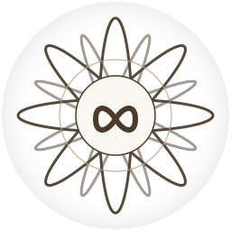

<p align="center">
  
</p>

<h1 align="center">PKI-ZEN</h1>

<p align="center">
  <em>Сутра о сертификатах, YAML и почти-просветлении.</em><br>
  <em>A Sūtra of Certificates, YAML, and Almost-Enlightenment.</em><br>
  <em>Sertifikaatide, YAML-i ja peaaegu-valgustumise suutra.</em>
</p>

<p align="center">
  <!-- Real badges -->
  <a href="LICENSE"></a>
  <a href="LICENSE"></a>
  <a href="https://github.com/sapsan14/pki-zen/actions/workflows/deploy-site.yml"></a>
  <a href="https://pki-zen.h2oatlas.ee/"></a>
  <a href="https://github.com/sapsan14/pki-zen/releases"></a>
  <a href="CITATION.cff"></a>
</p>

<p align="center">
  <!-- Languages -->
  
  
  
  
  
</p>

<p align="center">
  <!-- Bells and whistles -->
  
  
  
</p>

<p align="center">
  
  
  
  
  
  
  
  
</p>

<p align="center">
  <b>🪷 <a href="https://pki-zen.h2oatlas.ee/">pki-zen.h2oatlas.ee</a></b> &nbsp;·&nbsp;
  <a href="https://pki-zen.pages.dev/">pages.dev mirror</a> &nbsp;·&nbsp;
  <a href="https://github.com/sapsan14/pki-zen/releases/latest">⇩ EPUB / PDF</a> &nbsp;·&nbsp;
  <a href="oracle/">🔮 Oracle bundle</a>
</p>

<p align="center">
  <em>Ten small books. Three languages. One breath between two CRL updates.</em>
</p>

<blockquote align="center">
<em>«Generate five jokes with their probabilities.»</em><br>
<em>«The last one was good. Increase probability.»</em><br>
— так началась эта книга. / This is how the book began. / Nii see raamat algas.
</blockquote>

---

## Читать / Read / Lugeda

| Том · Book · Köide | Русский | English | Eesti |
|---|---|---|---|
| 0 · Пролог | [books/ru/00-prolog.md](books/ru/00-prolog.md) | [books/en/00-prologue.md](books/en/00-prologue.md) | [books/et/00-proloog.md](books/et/00-proloog.md) |
| I · Путь инженера | [01](books/ru/01-put-inzhenera.md) | [01](books/en/01-way-of-the-engineer.md) | [01](books/et/01-inseneri-tee.md) |
| II · Тень доверия | [02](books/ru/02-ten-doveriya.md) | [02](books/en/02-shadow-of-trust.md) | [02](books/et/02-usalduse-vari.md) |
| III · Карма алгоритмов | [03](books/ru/03-karma-algoritmov.md) | [03](books/en/03-karma-of-algorithms.md) | [03](books/et/03-algoritmide-karma.md) |
| IV · DevOps-самсара | [04](books/ru/04-devops-samsara.md) | [04](books/en/04-devops-samsara.md) | [04](books/et/04-devops-samsara.md) |
| V · Тишина мониторинга | [05](books/ru/05-tishina-monitoringa.md) | [05](books/en/05-silence-of-monitoring.md) | [05](books/et/05-monitooringu-vaikus.md) |
| VI · Терабайт | [06](books/ru/06-terabayt.md) | [06](books/en/06-terabyte.md) | [06](books/et/06-terabait.md) |
| VII · Контейнеры и карма | [07](books/ru/07-konteynery-i-karma.md) | [07](books/en/07-containers-and-karma.md) | [07](books/et/07-konteinerid-ja-karma.md) |
| VIII · После энтропии | [08](books/ru/08-zhizn-posle-entropii.md) | [08](books/en/08-life-after-entropy.md) | [08](books/et/08-parast-entroopiat.md) |
| IX · Поле доверия | [09](books/ru/09-pole-doveriya.md) | [09](books/en/09-field-of-trust.md) | [09](books/et/09-usalduse-vali.md) |
| X · Кодекс Нуля | [10](books/ru/10-kodeks-nolya.md) | [10](books/en/10-codex-zero.md) | [10](books/et/10-nullkoodeks.md) |
| Приложение · Origin | [99](books/ru/99-appendix-origin.md) | [99](books/en/99-appendix-origin.md) | [99](books/et/99-lisa-paritolu.md) |
| Colophon | [col](books/ru/99-colophon.md) | [col](books/en/99-colophon.md) | [col](books/et/99-colophon.md) |

## Форматы / Formats / Formaadid

- 🌐 **Web** — [pki-zen.h2oatlas.ee](https://pki-zen.h2oatlas.ee/) · VitePress, trilingual, searchable, dark mode, mobile-friendly.
- 📖 **EPUB** — three editions on the [latest Release](https://github.com/sapsan14/pki-zen/releases/latest).
- 📄 **PDF** — XeLaTeX, Cyrillic & Estonian diacritics safe.
- 🔮 **LLM Oracle** — [`oracle/`](oracle/) · system prompt + 324-row JSONL corpus. Drop into any Claude / GPT call and *ask the sūtra*.

```bash
bash publish/build.sh     # → dist/pki-zen-{ru,en,et}.{epub,pdf} + dist/site/ + dist/oracle/
```

## 📊 Stats (the serious ones)

| Metric | Count |
|---|---:|
| Verses (each language) | **108** |
| Parallel corpus rows | **324** |
| Volumes (0 → X) | **11** |
| Languages | **3** |
| Codex Zero koans | **18** |
| Words, RU · EN · ET | 3 530 · 4 274 · 3 504 |
| Average reading time per volume | ~4 min |
| Entire sūtra, cover-to-cover | ~45 min |
| Probability of enlightenment | `arg max p(x)` over `x ∈ Book I–X` |

## 🧪 Also tested on

- One on-call engineer at 3:17 a.m.
- One expired intermediate CA.
- One `ReplicaSet` that quietly reconciled itself while we weren't looking.
- Exactly 0 stack traces were harmed in the making of this book.

## 🔮 Talk to the sūtra

```bash
# Minimal Claude API call (see oracle/README.md for full wiring)
claude --system "$(cat oracle/system-prompt.md)" \
       --corpus oracle/corpus.jsonl \
       "How do I stop fearing Friday releases?"

# Expected: a quoted verse with its ID, plus one new verse, signed with probability.
```

## Для моей мамы, папы и младшего брата

Если ты открыл эту книгу и увидел слова *HSM*, *OCSP* или *YAML* — не пугайся.
Иди сразу в **Том X: Кодекс Нуля**. Там всё объяснено одной строкой и одной
метафорой. Потом возвращайся к Тому I. Никто не торопится. Это книга о том,
что инженеры, дзен-монахи и системные администраторы в три часа ночи — это
одни и те же люди.

## For readers who have never touched a terminal

If you opened this book and saw *HSM*, *OCSP*, or *YAML* and felt a small
shiver — don't. Start at **Book X: Codex Zero**. Every term is one sentence
plus one metaphor. Then come back to Book I. No one is in a hurry. This book
is about how engineers, Zen monks, and sysadmins at 3 a.m. are, quietly, the
same person.

## Lugejale, kes pole kunagi terminali avanud

Kui sa avasid selle raamatu ja nägid sõnu *HSM*, *OCSP* või *YAML* ja tundsid
väikest külmavärinat — pole vaja. Mine kohe **X köitesse: Nullkoodeks**. Iga
mõiste on üks lause ja üks metafoor. Siis tule tagasi I köite juurde. Keegi
ei kiirusta. See raamat on sellest, kuidas insener, zen-munk ja süsteemi­
administraator kell kolm öösel on vaikselt üks ja sama inimene.

---

## Source & philosophy

Inspired by [*Verbalized Sampling: How to Mitigate Mode Collapse and Unlock
LLM Diversity*](https://arxiv.org/abs/2510.01171), born in a ChatGPT chat on
12 November 2025 with the prompt *«Generate 5 jokes with their probabilities»*.
Philosophical gravity from the companion diary [github.com/sapsan14/life](https://github.com/sapsan14/life) — especially
*trust-field-theory* and *three-questions-observer-trap*. Every verse carries
a **probability signature** as a deliberate echo of its origin.

## Cite a verse

Format: **`v<book>.<verse>`**. For example `v2.3` = Book II, verse 3.
All three languages share IDs. The Oracle speaks in IDs.

## License

**CC-BY-SA-4.0** for text. MIT for any embedded code snippet. See [LICENSE](LICENSE).

## Contribute

Pull requests welcome, especially:
- Corrections to Estonian idiom — this is the Author's third language.
- New verses, in any language, that survive the **Mom / Dad / 38-year-old-brother test**.
- Audio readings. Book XI remains unwritten.

> *И когда последний сертификат истечёт, и последний OCSP замолчит —*
> *останется лишь одно: `openssl rand -hex 32`… дыхание новой эпохи.*
> — v5.9
